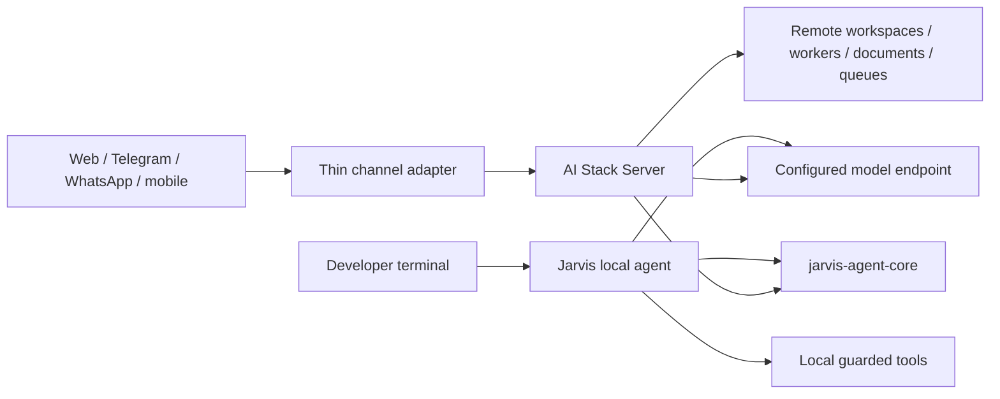

# Product and channel architecture

## Product boundaries



Jarvis is the primary single-user/local product. AI Stack Server is the optional
durable multi-user control plane. Core supplies portable contracts/primitives;
it is not a third agent implementation.

A channel adapter authenticates, normalizes, deduplicates and transports user
messages/events. It never duplicates planning, routing, repository tools or
completion policy.

## Shared and separate concerns

| Concern | Core | Jarvis | Server |
| --- | --- | --- | --- |
| Token/context/evidence/routing types | Owns portable contracts | Enforces local | Enforces durable |
| Files/commands/Git edits | No | Local workspace | Remote sandbox/workspace |
| Local session storage | No | Owns | No |
| Durable shared run/event storage | Contracts only | Client | Owns |
| Tenant/channel identity | No | No | Owns |
| Web evidence | Normalization contracts | Local search/fetch | Server search/fetch |
| Multi-agent roles/results | Contracts | Local selective flow | Durable expert dispatch |
| Permission vocabulary | Contracts | Local policy/prompts | Central policy/approvals |
| Lease/execution state | Contracts | Cloud worker/client | Durable owner |
| OS/process sandbox | No | Local implementation | Runner implementation |
| Provider credentials | No | Local profile secrets | Server/worker secrets |
| Cost/price policy | Budget contracts | User policy | Central policy/catalog |

## v0.9 cross-product event contract

A world-class durable agent needs one event vocabulary shared by local TUI,
Server, web/mobile and channel adapters. Product-specific transports may differ,
but semantics should not.

Proposed event classes:

```text
run.created
run.state_changed
model.started
model.delta
model.completed
tool.proposed
tool.approval_required
tool.started
tool.output
tool.completed
process.started
process.output
process.exited
proof.updated
budget.updated
checkpoint.created
user.steer
user.interrupt
run.completed
run.failed
run.cancelled
```

Each durable event should carry:

- protocol/event version;
- run ID and monotonic sequence/cursor;
- attempt/lease ID where relevant;
- timestamp;
- bounded redacted payload;
- idempotency identifier for client-originated commands;
- policy/budget snapshot identity when behavior depends on it.

A reconnecting client resumes from a cursor. Repeated steer/approval/cancel
commands are idempotent. A stale command scoped to another run/lease is rejected.

Local mode can use the same event objects in memory/JSONL without requiring
Server.

## User steering and interruption

Steering is not equivalent to starting a second run. A steer command updates the
active run's canonical transcript/checkpoint and influences subsequent
model/tool work.

Rules:

1. never replay a completed mutation merely because the model is restarted;
2. provider generation may be cancelled when the adapter supports it;
3. otherwise apply the steer at the next safe model/tool boundary;
4. approval prompts always refer to the exact proposed side effect and run;
5. interruption/cancellation stops owned child processes and cloud work;
6. transcript remains protocol-safe and resumable.

## Side-effect capability model

A single read/write flag is too coarse for mature agent safety. v0.9 should move
toward typed capabilities:

- `filesystem_read`
- `filesystem_write`
- `process_spawn`
- `process_stdin`
- `network_read`
- `external_side_effect`
- `secret_read`
- `browser_interaction`
- `mcp:<server>:<tool>`

Repository policy is restrict-only. Trusted user/organization policy may grant
or pre-approve capabilities. Plan mode denies all mutation/external-side-effect
classes even if repository content requests otherwise.

Browser clicks/types are external side effects because they can change remote
state.

## Budget snapshot

Every autonomous run should have an immutable budget/policy snapshot containing
hard limits such as:

```json
{
  "max_wall_seconds": 3600,
  "max_input_tokens": 200000,
  "max_output_tokens": 30000,
  "max_model_attempts": 20,
  "max_tool_calls": 100,
  "max_changed_files": 20,
  "max_changed_lines": 2000,
  "max_estimated_cost": 5.0,
  "allow_paid_escalation": false
}
```

Crossing a hard limit pauses/fails explicitly. Routing cannot silently increase
the budget or switch to a paid route beyond policy. Budget events and final
proof explain what was consumed and why execution stopped/escalated.

## Exact execution/proof identity

The authoritative identity for remote work is:

```text
run_id + task_id + attempt + lease_id + proof_id
```

`latest` convenience pointers are never sufficient for durable completion when
multiple runs can share a workspace. Server persists the exact proof ID accepted
with the fenced completion.

## Local-to-cloud handoff

A first-class handoff should preserve execution context without transferring
secrets:

```json
{
  "repository_url": "https://host/org/repo.git",
  "base_commit": "...",
  "dirty_patch_digest": "...",
  "transcript_checkpoint": "artifact://...",
  "task": "...",
  "permission_policy_id": "...",
  "budget_snapshot_id": "...",
  "model_policy": "auto",
  "skill_lock_id": "...",
  "source_proof_id": "..."
}
```

Provider/API credentials are resolved on the destination from trusted
configuration; they never appear in the portable payload.

Server may execute multiple isolated attempts. Jarvis compares returned proof,
diff and verification evidence and applies the selected result through the
normal local review/undo ledger.

## Skills/plugins/policy versions

For reproducibility, a durable run should snapshot immutable identifiers for:

- Core/protocol version;
- model profile/routing policy;
- permission policy;
- Skills/plugins and their versions/signatures;
- sandbox/runner image/toolchain;
- repository base commit;
- budget policy.

Historical runs remain explainable even after current configuration changes.

## Channel envelope

```json
{
  "channel": "telegram|whatsapp|web|mobile",
  "tenant_id": "stable-tenant-id",
  "user_id": "verified-internal-user-id",
  "conversation_key": "channel-thread",
  "message_id": "provider-message-id",
  "idempotency_key": "channel:message-id",
  "text": "user request",
  "attachments": [],
  "reply_context": {},
  "capabilities": {
    "supports_streaming": false,
    "supports_buttons": true
  }
}
```

The adapter verifies provider signature/session, maps identity, deduplicates,
validates/quarantines attachments, creates/continues a Server run, acknowledges
before provider deadlines, consumes durable events and queues bounded
channel-safe progress/final replies.

## Approvals

Research/status can be surfaced broadly. Repository edits, commands, browser
side effects, financial/account actions and other sensitive operations require
an explicit approval event scoped to the exact run/action.

Use signed expiring buttons for narrow low-risk actions and a Runs UI deep link
for diffs/high-risk approval. Plain text `yes` in a different/stale thread is
not valid authorization.

## Security and operations

Production multi-tenant Server additionally requires:

- HTTPS plus OIDC/OAuth and resource-level tenant authorization;
- server-side/worker secrets with rotation and no provider keys in clients;
- quotas, queue fairness/admission/backpressure and capacity SLOs;
- attachment malware/quarantine and tenant-scoped artifact lifecycle;
- prompt-injection labeling for message/document/search/connector data;
- no channel-supplied filesystem paths;
- audit events for identity, run, tool, approval, proof, budget and delivery;
- retry/backoff/dead-letter behavior with side-effect idempotency;
- retention/deletion/export, backup/restore and DR tests;
- runner/sandbox provenance and reproducible release artifacts.

## Repository and release strategy

Jarvis, Server and Core remain separate repositories. Release Core first, then
pin consumers to that immutable wheel/checksum and execute consumer plus
cross-repository gates.

The Server protocol remains versioned under `contracts/`. Breaking pre-1.0
changes are coordinated releases with compatibility tests, not hidden divergent
schemas.

See [world-class-platform-gaps.md](world-class-platform-gaps.md) for current
production gaps and the Jarvis world-class gap analysis for coding-agent UX and
local runtime gaps.
