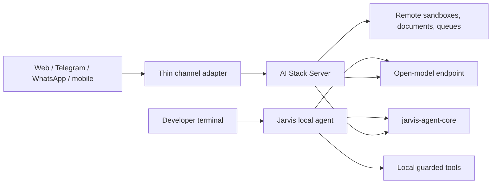

# Product and channel architecture

## Product boundaries



Jarvis is the primary single-user local product. Server is the optional durable,
multi-user control plane. Core supplies portable contracts, not a third agent.
A channel adapter never duplicates planning or tools; it authenticates and
normalizes messages into Server runs.

## Shared and separate concerns

| Concern | Core | Jarvis | Server |
| --- | --- | --- | --- |
| Token budgets, compaction, evidence, routing types | Owns | Consumes | Consumes |
| Files, commands, Git patches | No | Local workspace | Remote sandbox/workspace |
| Session storage | No | Local SQLite/JSONL | Durable DB/events |
| Tenant/channel identity | No | No | Owns |
| Web evidence | Normalization contracts | Local SearXNG/fetch | Server SearXNG/fetch |
| Multi-agent roles/results | Contracts | Selective local flow | Selective expert dispatch |
| Approval policy | No | Local prompts | Durable central approval |

## Channel envelope

```json
{
  "channel": "telegram|whatsapp|web|mobile",
  "tenant_id": "stable-tenant-id",
  "user_id": "verified-internal-user-id",
  "conversation_key": "channel-thread",
  "message_id": "provider-message-id",
  "idempotency_key": "channel:message-id",
  "text": "user request",
  "attachments": [],
  "reply_context": {},
  "capabilities": {
    "supports_streaming": false,
    "supports_buttons": true
  }
}
```

The adapter verifies the provider signature/session, maps identity, deduplicates,
quarantines and validates attachments, creates or continues a Server run,
acknowledges before webhook deadlines, consumes durable events, and queues a
bounded channel-safe reply. Retries must not duplicate runs or replies.

## Approvals

Chat channels are suitable for research, summaries, and status. Repository
edits, command execution, financial actions, account changes, and other
sensitive operations require an explicit approval event. Use signed expiring
buttons for narrow low-risk actions and a Runs UI deep link for diffs or
high-risk approval. A plain “yes” in a different or stale thread is not valid.

## Integration sequence

1. Build a reusable Server Runs client and channel envelope.
2. Ship the authenticated web client first to exercise full replay/approval.
3. Add Telegram with secret-token verification, identity linking, deduplication,
   edited progress messages, and signed approval buttons.
4. Add WhatsApp using the official Business/Cloud API, signature verification,
   identity linking, conversation-window/template handling, and queued replies.
5. Add mobile with OIDC, event streaming, privacy-safe push notifications, and
   the same Runs UI approval model.

Provider rules and pricing belong inside adapters because they can change
without changing the Server run contract.

## Security and operations

- HTTPS, signature verification, OIDC identities, and tenant isolation;
- server-side secrets with rotation and no provider keys in clients;
- per-user/channel quotas, outbound URL controls, and attachment malware scans;
- prompt-injection labeling for every message, attachment, search, and connector;
- no channel-supplied filesystem paths;
- audit events for linking, runs, tools, approvals, and delivery;
- retry/backoff, provider rate limits, dead-letter state, and idempotency;
- retention/deletion controls, redacted logs, backup/restore, and cross-tenant
  tests.

## Repository and release strategy

Jarvis, Server, and Core are separate repositories. Release Core first, then
validate compatible Jarvis and Server branches against that published version.
The Server protocol remains versioned under `contracts/`; consumers should
test the published contract or a versioned artifact rather than copy divergent
schemas. Breaking pre-1.0 changes are coordinated releases, not hidden
compatibility shims.
