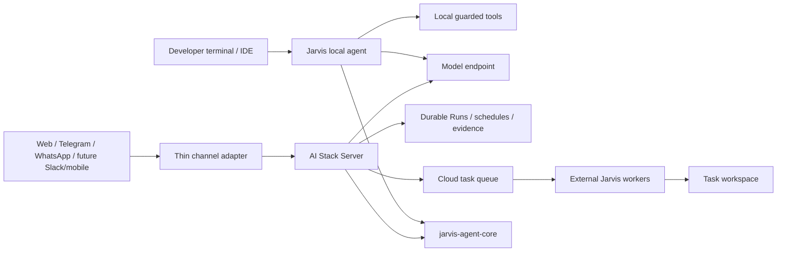
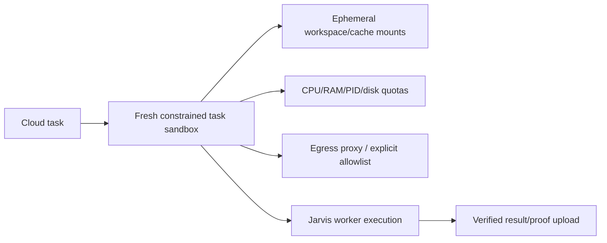

# Product and channel architecture

## Product boundaries



Jarvis is the primary single-user local coding product. Server is the optional durable control plane. Core supplies portable contracts, not a third agent implementation. Channel adapters authenticate/normalize/deduplicate and create Server work; they do not create parallel planning/tool implementations.

## Shared and separate concerns

| Concern | Core | Jarvis | Server |
| --- | --- | --- | --- |
| Token/context/evidence/routing/state contracts | Owns | Consumes | Consumes |
| Files, commands, Git patches | No | Local workspace | External worker / remote workspace |
| Sessions/events | No persistence | Local SQLite/JSONL/proof | PostgreSQL durable Runs/events |
| Tenant/channel identity | No | Single-user/operator | Platform responsibility |
| Web evidence | Contracts only | Local search/fetch | Server search/fetch |
| Multi-agent roles/results | Contracts | Adaptive local execution | Expert/cloud coordination |
| User edit/command permissions | Contracts/primitives | Local prompts/policy | Durable approval/policy |
| Lease fencing/idempotency | Contracts | Worker client | Queue/state owner |
| Per-task process isolation | No | OS sandbox on developer host | **Not yet a strong multi-tenant sandbox** |

## Cloud execution trust boundary

Lease fencing answers **who owns the right to publish a task result**. It does not answer **what damage a task process can do to a shared worker host**.

The current cloud worker prepares an existing or ephemeral Git workspace and runs Jarvis on the worker host. Jarvis applies its local permission/network sandbox controls, and the Server rejects stale fences. This is suitable for trusted single-tenant/self-hosted worker fleets.

For hostile or multi-tenant workloads, the target architecture is:



The task sandbox should use a container/VM-style isolation boundary with seccomp/AppArmor or equivalent where available, a read-only base image, explicit writable mounts, resource quotas and policy-controlled egress. Dependency/bootstrap caches must be content-addressed or otherwise identity/invalidation-safe; one repository must not inherit mutable state or credentials from another.

## Cloud state and ownership

v0.8 cloud tasks are durable state machines. Each claim creates a unique lease ID. Worker heartbeat/state/completion writes must match the current `(task, worker, lease)` fence and an unexpired lease. Cancellation is terminal; reclaimed tasks invalidate previous workers.

Submission supports idempotency keys, and reuse with a different payload is rejected. Git workspace coordinates are validated before queueing/checkout. Provider credentials remain worker-local and are not included in task payloads.

## Channel envelope

```json
{
  "channel": "telegram|whatsapp|web|mobile|slack",
  "tenant_id": "stable-tenant-id",
  "user_id": "verified-internal-user-id",
  "conversation_key": "channel-thread",
  "message_id": "provider-message-id",
  "idempotency_key": "channel:message-id",
  "text": "user request",
  "attachments": [],
  "reply_context": {},
  "capabilities": {
    "supports_streaming": false,
    "supports_buttons": true
  }
}
```

An adapter verifies provider signature/session, maps identity, deduplicates, quarantines/validates attachments, creates/continues a Run, acknowledges within provider deadlines, consumes durable events and queues a bounded channel-safe reply. Retries must not duplicate runs or deliveries.

Telegram/WhatsApp foundations exist; Slack is a future parity/integration item, not a current capability claim.

## Approvals and identities

Chat channels are appropriate for research, summaries and status. Repository mutation, commands and other side effects require an approval tied to the correct authenticated actor, run, action and expiry window. A plain “yes” in an unrelated/stale thread is not an authorization primitive.

The future multi-tenant platform additionally needs OIDC/OAuth identity, scoped service/worker tokens, organization policy and immutable administrator denies. Those are roadmap items, not properties of the current self-hosted single-tenant deployment.

## Evidence and prompt-injection boundary

Messages, attachments, repositories, search results, browser pages, MCP/tool output and model output are untrusted data. They may contribute evidence; they cannot broaden permissions. Execution claims should be backed by tool/test/proof events rather than model statements.

World-class production testing still needs an explicit hostile-input suite with secret canaries across all these sources and chaos tests across queue/worker/Server failure modes.

## Reliability and capacity architecture

Before multi-user production scale, Server needs:

- admission control and bounded queue depth;
- per-tenant/user/project quotas;
- fair scheduling and starvation prevention;
- worker capability/version registration and compatibility checks;
- backpressure when model/worker/storage capacity is saturated;
- autoscaling signals rather than unbounded polling/claims;
- durable dead-letter/retry policy for non-retryable versus transient failure;
- disk/state/backup/restore/DR exercises.

## Observability

The platform should correlate one trace/run identity across channel ingress, routing, model/tool activity, queue submission, worker lease attempts, verification, proof and outbound delivery. Existing OpenTelemetry and durable events are the foundation. Production dashboards still need cost/token/latency, tool failure, fallback, lease loss, queue latency and escalation metrics.

## Repository and release strategy

Jarvis, Server and Core are separate repositories. Release Core first; consumers pin only an immutable published wheel/checksum. The v0.8.1 audit added regression checks because the v0.8 merge initially left consumers on Core 0.7.0.

The Server protocol remains versioned under `contracts/`; consumers should test the published/versioned contract rather than copy divergent schemas. Breaking pre-1.0 changes require coordinated releases and explicit compatibility tests.

## Current certification status

Core v0.8.0's public artifact has been checksum/install verified. Private Jarvis/Server Actions currently fail before runner provisioning, so v0.8.1 changes are statically audited and regression-covered in source but not release-certified. See [../TODO.md](../TODO.md).
