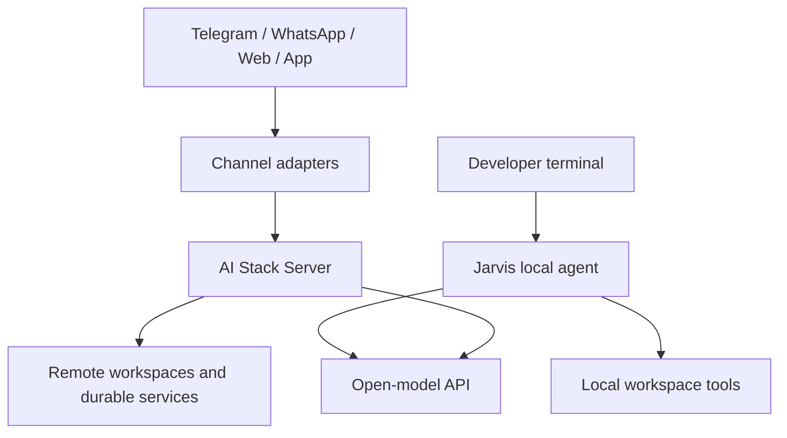

# Product and channel architecture

## Product model

Jarvis is the primary local coding product. Server is an optional shared,
durable backend.



Jarvis and Server may use the same inference endpoint, but they own different
tools. Jarvis tools execute on the user's computer. Server tools execute only
in server-approved sandboxes and mounted workspaces.

## Why channels use Server

A messaging or mobile client cannot safely own long-running model loops,
repository sandboxes, provider credentials, queues, or durable approvals.
Channel clients therefore normalize input and call Server. They do not become
new “agents.”

A future shared `jarvis-core` package can hold provider adapters, tool
contracts, the bounded loop, and event types used by both products. Execution
policy and tool implementations remain product-specific.

## Channel adapter contract

Normalize every inbound message into one internal envelope:

```json
{
  "channel": "telegram|whatsapp|web|mobile",
  "tenant_id": "stable-tenant-id",
  "user_id": "verified-internal-user-id",
  "conversation_key": "channel-specific-thread",
  "message_id": "provider-message-id",
  "idempotency_key": "channel:message-id",
  "text": "user request",
  "attachments": [],
  "reply_context": {},
  "capabilities": {
    "supports_streaming": false,
    "supports_buttons": true
  }
}
```

The adapter:

1. verifies the provider signature or authenticated app session;
2. maps the external identity to an internal tenant and user;
3. deduplicates the message with the idempotency key;
4. validates/downloads attachments into quarantined object storage;
5. creates or continues a Server conversation and run;
6. acknowledges quickly, before provider webhook deadlines;
7. consumes durable run events asynchronously;
8. renders bounded, channel-safe replies;
9. records delivery attempts and retries transient failures.

Outbound delivery must use a queue with exponential backoff, provider-specific
rate limits, and a dead-letter state. A repeated webhook or worker restart must
not create another agent run or duplicate a reply.

## Approval model

Messaging channels are suitable for reading, research, summaries, and status.
Repository edits, command execution, financial actions, account changes, or
other sensitive operations require an explicit approval event.

Use signed, short-lived buttons for low-risk approvals. For high-risk or
complex diffs, send a deep link to Runs UI where the user can inspect evidence
and the exact change. Never interpret a plain “yes” from an unrelated or stale
conversation as approval.

## Telegram

1. Create a bot and store its token only in Server's secret manager.
2. Expose an HTTPS webhook endpoint in a Telegram adapter.
3. Verify the configured webhook secret token.
4. Map Telegram user/chat/thread IDs to internal identities and conversations.
5. Return an immediate acknowledgement and enqueue the run.
6. Send progress sparingly; edit one status message instead of flooding chat.
7. Use inline buttons containing signed, expiring approval references.

Long outputs should be summarized in chat with a Runs UI link or file export.

## WhatsApp

Use the official WhatsApp Business/Cloud API:

1. configure Meta webhook verification and validate request signatures;
2. keep access tokens and app secrets server-side;
3. map phone/account identities only after an explicit linking flow;
4. handle conversation-window and template-message rules in the adapter;
5. deduplicate webhook retries by provider message ID;
6. send queued, rate-limited outbound messages;
7. use Runs UI deep links for diffs and sensitive approvals.

Provider rules and pricing can change, so the adapter must isolate those
details from the core run API.

## Web and mobile apps

The app authenticates users with OIDC/OAuth and calls an API gateway. Create
runs through REST, then consume progress using Server-Sent Events or WebSocket
fan-out backed by durable Server events. Never expose the model provider key to
the app.

Recommended screens:

- conversation and run list;
- live event timeline;
- attachment upload and document scope;
- diff/evidence review;
- approve, discard, cancel, and retry;
- workspace/project selection;
- model/budget visibility allowed by policy.

Mobile push notifications should carry only a run identifier and safe summary;
the app retrieves authorized details after opening.

## Security requirements

- HTTPS everywhere and signature verification before parsing large bodies;
- OIDC-linked identities and tenant isolation;
- secrets in a managed server-side store with rotation;
- per-user/channel quotas and rate limiting;
- strict attachment size/type limits, malware scan, and content isolation;
- prompt-injection labeling for all channel and attachment content;
- no arbitrary filesystem path supplied by a channel user;
- audit events for identity linking, run creation, tools, approvals, and delivery;
- data retention/deletion controls and redacted logs;
- explicit outbound URL policy to prevent SSRF;
- end-to-end tests for replay, duplicate delivery, forged signatures, and
  cross-tenant access.

## Delivery plan

| Phase | Deliverable | Exit gate |
| --- | --- | --- |
| 1 | Stable channel envelope and Server Runs client | Contract and idempotency tests |
| 2 | Web app adapter | Auth, event replay, approvals, tenant tests |
| 3 | Telegram adapter | Signature, retry, rate-limit, and linking tests |
| 4 | WhatsApp adapter | Meta verification, template/window, retry tests |
| 5 | Mobile app | OIDC, push privacy, offline/resume tests |
| 6 | Platform hardening | SLOs, load tests, audit, backup/restore, canary |

Build web first because it exercises the complete authenticated run and
approval experience without messaging-provider constraints. Reuse that
approval UI from Telegram and WhatsApp deep links.

## Repository strategy

Keep Jarvis and Server in this monorepo while their shared protocol and core
interfaces are changing quickly. Split Jarvis only after:

- the protocol is a separately versioned, published artifact;
- `jarvis-core` boundaries are stable;
- cross-repository compatibility CI exists;
- independent release/install/upgrade paths are tested;
- ownership and security-response processes are defined.

A split should improve distribution and contribution boundaries without
forking the agent loop or creating two incompatible protocol definitions.
